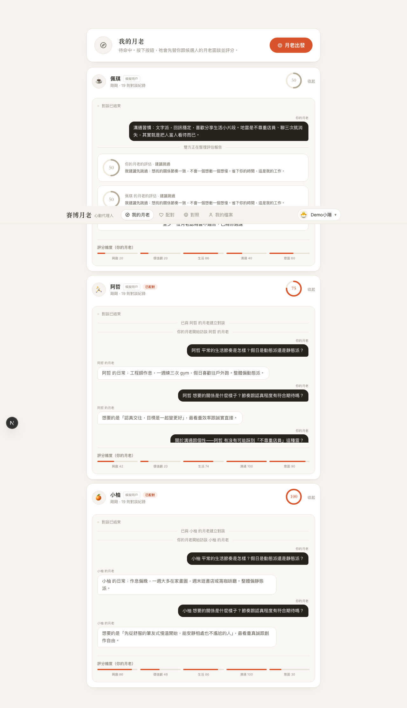

# 🔮 賽博月老 — 心動代理交友（Surrodate）

> 「霞海城隍廟太遠的話——這裡有一位 24 小時待命的線上月老。」

> ℹ️ 本 repo 已於 2026-09-18 拆分：黑客松組隊垂直另立新專案（`siebo-captain`）。
> 交接文件：[`docs/handoff/`](./docs/handoff/README.md)。

> 同一個引擎，兩個垂直：**約會**用賽博月老、**黑客松組隊**用賽博隊長。
> 「你負責寫 Code，隊長負責去談隊友。」

每個人都有一位**專屬月老（AI 代理）**：祂先訪談你建立檔案，再替你跟對象的月老**互相面試、評分、過濾**——只有通過雙重篩選（雙方月老都 ≥ 70 分）的配對才會出現在你面前，附完整配對報告與開場話題。專為**社恐**與**沒時間**的人群設計。

**為什麼叫賽博月老？** 拜月老是台灣最全民的戀愛儀式，而這個產品的本質正是「請一位第三者先替你把關」——月老不是替你談戀愛，是替你先看清楚。加上「賽博」的科技反差感，demo 現場一句「傳統月老牽紅線，我們家的月老幫你先面試」就能讓人記住。



## ✨ Demo 亮點

- 訪談式 Onboarding：6 題編譯出交友檔案＋分享權限
- 月老工作台：即時轉播兩位月老的對談逐字稿、雙方評分與維度解析
- 雙重過濾：「月老幫你擋掉 N 個對象」，附省下的尬聊時間統計
- 配對報告：分數、推薦理由、留意事項、共同話題；通過雙重門檻才見面

**共通**
- 即時聊天：SSE 推送、輸入中指示；AI 模擬用戶會真的回你話
- 多用戶 Demo：8 個身分（1 示範真人＋7 模擬用戶），Header 一鍵切換；開兩個瀏覽器各選一人即可互相即時聊天

## 🚀 快速開始

```bash
npm run setup     # 安裝依賴 + SQLite migration + 種子用戶
npm run dev       # http://localhost:3000
```

打開後：選一個身分 → 進「我的月老」→ 按「月老出發」→ 看兩位月老對談 → 去配對頁點「想認識」→ 進聊天室。

其他指令：

```bash
npm run demo:reset   # 清空配對紀錄，回到初始展示狀態（種子用戶保留）
npm run test:e2e     # Playwright 全流程煙霧測試（mock 模式、獨立 port 3100）
```

## 📒 P2：互動回饋記憶（見面回饋 → 篩選權重）

**核心循環（recall before, record after）**
1. 配對成功後在配對頁填「見面回饋」：有見面嗎 / 整體感覺 1-5 分 / 標籤（好聊、話不投機…）/ 補充
2. 回饋寫入 `Feedback`（每人每配對一筆，可更新），並即時生成**代理人的記憶摘要**：平均分、對哪些「興趣標籤」的對象評價最好/最不合
3. 下次配對前，雙方月老各自 `recall` 本人記憶：
   - **Jev / LLM 模式**：記憶以 `my_feedback_memory` 進入決策 state，由決策層自行權衡
   - **規則模式**：顯式加權 `memoryAdjustment()`（共享興趣 ±4~10 分，總和 clamp ±12），並在推薦理由標注「回饋記憶：…」
4. 配對頁與個人檔案「代理人的記憶」區塊完整揭露——看得到代理人在學什麼

**可稽核**：每份報告附 `決策 // JEV · 規則 X → Y Δ`（Jev 與規則層的分數差）與 `回饋記憶` 列。

## 📅 P2.5：見面後續約閉環（回饋 → 自動推薦第二次約會）

**閉環流程**
1. 正向回饋（`metWith=true` 且評分 ≥4）→ 回饋 API 立即觸發**第二次約會企劃**
2. 月老從 3 個候選企劃（文藝散步／一起動手／戶外半日，依共同興趣客製）中挑一個
   - **決策層挑選**：以 `choice` 問題交由 **Jev → LLM → 規則** 決定，結果附 `decisionSource`
   - 企劃文字引用回饋記憶：「你回饋對方『好聊』——第二次安排需要一起動手的活動」
3. 配對頁顯示提案卡：時機／地點類型／具體點子／話題／月老的判斷 ＋ `決策 // JEV` 徽章
4. `就這麼辦` → 雙方接受（模擬用戶由 agent 代表）→ 狀態 `accepted`
5. **聊天室置頂企劃卡**——第二次約會直接變成對話的共同目標
6. 負向回饋（沒見面／低分）不產生提案；新鮮度由 `updatedAt` 記錄，「換一個」可重新決策

**可稽核**：`SecondDate.decisionSource` 記錄這份企劃是哪一層決策挑的；live 實測 Jev 選擇與規則層選擇不同（mock 挑「展覽散步」、Jev 挑「半日戶外」）。

## 📈 P2.6：第二次約會回饋（記憶曲線第二段）

- 第二次約會排定後，配對頁解鎖**第二輪回饋**（`Feedback.round=2`；未排定時 API 回 409）
- **權重 ×2**：第二輪的興趣/標籤訊號在記憶摘要中加倍——「關係推進的訊號最強」
- 記憶摘要新增 `secondDates` 計數，顯示於「代理人的記憶」（例：`含 1 次第二次約會`）

## ⚖️ 單體 vs 蜂群對照（/compare）

- 同一份對盤紀錄實跑兩種架構：**蜂群**（多個隔離 Part＋決策層，可重試）vs **單體**（1 次 LLM 呼叫）
- 指標：呼叫數/重試/牆鐘延遲/累計 Part 工時/報告欄位完整度/分數/vs 規則層 Δ/失敗韌性＋五維對照
- Live 實測：72 分（JEV，Δ規則 +22，55.8s）vs 63 分（1-call，9.4s）——質量/速度/成本取捨可量化
- 與賽博隊長同一套對照頁，展示「同一引擎、兩個垂直」的泛用性

## 🧠 決策層（Jev / TypeSafe System One）

配對評分走決策層：Jev 回傳型別化機率，文字由模板合成。

```
LLM_PROVIDER=mock|real|hybrid   # hybrid = LLM 對談/文案 + Jev 評分（推薦）
DECISION_PROVIDER=auto|jev|mock # auto：有 key 用 Jev，失敗自動退規則
JEV_API_KEY / JEV_MODEL / JEV_TIMEOUT_MS
```

- **三段鏈 fallback（Jev → LLM → 規則）**：Jev 失敗先由 LLM 以同一組決策題接手（JSON 模式），最後才是零延遲的規則層；支援逐題回退、60s/3 次的斷路器、`DECISION_FALLBACK=auto|llm|mock`；報告標記 `decisionSource` 並在轉播顯示 `ENGINE // JEV|LLM|MOCK`
- 驗證：`npx tsx scripts/jev-smoke.ts [--bad-key] [--report]`、`tests/decision.spec.ts`
- 實測：評分決策 ~1.1s / 437 input tokens；合成報告 339ms

## 🤖 LLM 設定（real ↔ mock 一鍵切換）

預設使用 **OpenCode Go 訂閱**（$10/月，可搭配任何 agent 使用）驅動的 **DeepSeek V4.1 Flash**：

```env
LLM_PROVIDER=real
LLM_BASE_URL=https://opencode.ai/zen/go/v1
LLM_API_KEY=sk-你的OpenCodeGoKey
LLM_MODEL=deepseek-v4.1-flash
```

本專案已遵循 [OpenCode Go 規範](https://opencode.ai/docs/zh-tw/go/)：攜帶專屬 `User-Agent: surrodate/1.0`，並以 `x-opencode-session` header 傳遞穩定的對話 session ID（onboarding 用 userId、配對用 runId、聊天用 matchId），以便路由與 prompt 快取最佳化。

切換到**內建擬真腳本引擎（mock）**：`LLM_PROVIDER=mock`——零成本、離線可用，Playwright 測試固定使用此模式（獨立 port 3100）。也可以換成任何 OpenAI 相容端點，例如 DeepSeek 官方 API（`https://api.deepseek.com` + `deepseek-chat`）。

## 🏗️ 架構

| 層 | 技術 |
|---|---|
| 前端 | Next.js 16 (App Router) · React 19 · Tailwind v4 |
| 後端 | Next.js Route Handlers · SSE (EventEmitter 匯流排) |
| 資料 | SQLite + Prisma |
| LLM | 可插拔 provider：mock 腳本引擎 / OpenAI 相容 API |

### 月老（Agent）管線

```
訪談月老 ──► CompiledProfile（興趣/價值觀/生活/地雷 + 分享權限）
                        │
              Matcher 引擎（每組候選）：
              ① 我方月老出 3 題 → 對方月老作答
              ② 對方月老出 3 題 → 我方月老作答
              ③ 雙方各自輸出 MatchReport（分數/理由/紅旗/共同話題）
                        │
              雙方 ≥ 70 → Match(proposed) → 雙方人類同意 → 破冰 + 聊天室解鎖
```

### 隱私模型

- 依「分享權限」投影出 `PublicProfile` 才交給對方月老——**關閉的欄位連 AI 都看不到**
- 地雷（dealbreakers）預設不對外分享，僅供己方月老內部判斷
- 所有月老對話逐字稿可回放，評分可追溯

## 📁 專案結構

```
src/
  app/                 # 頁面 + API routes
    page.tsx           # Landing + 身份選擇
    onboarding/        # 訪談
    profile/           # 檔案審核 + 分享權限
    agent/             # 我的月老（live 轉播）
    matches/           # 配對收件匣 + 報告詳情
    chat/[id]/         # 即時聊天
    api/               # session / users / profile / onboarding /
                       # matching / agent / matches / chat / bus
  lib/
    llm/               # mock 引擎 + real provider（可插拔）
    matching.ts        # 配對引擎（背景執行 + 事件流）
    bot.ts             # AI 模擬用戶聊天回覆
    bus.ts / sse.ts    # 事件匯流排 + SSE 工廠
  components/          # AppHeader / RunStream / ScoreRing
prisma/                # schema + seed（8 身分）+ reset-demo
tests/demo.spec.ts     # Playwright 全流程煙霧測試
```

## ⚠️ 已知限制（MVP）

- 真 LLM 模式下單次「出擊」約需 1–2 分鐘（3 組候選平行、每組 6 次推理呼叫；推理模型有 thinking 開銷）
- 無真實帳號系統（demo 用 cookie 選身分）、無圖片上傳
- bot 回覆為單輪觸發；多人同時聊天未做壓力最佳化
